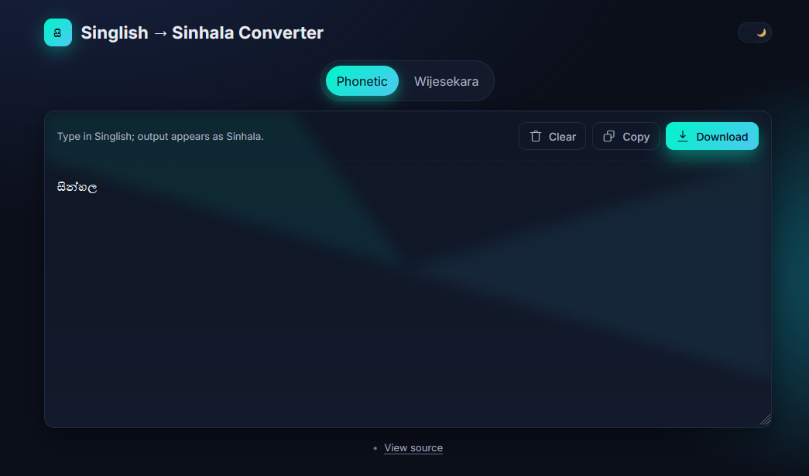

# Singlish to Sinhala Unicode Converter

A simple, modern, and beautiful web-based tool to convert Singlish (Sinhala typed with English letters) to Sinhala Unicode text in real-time. It features a clean, dark-mode interface and supports both Phonetic and Wijesekara keyboard layouts.

---

## ✨ Features

* **Real-time Conversion**: Instantly converts your Singlish input into Sinhala script as you type.
* **Dual Keyboard Layouts**: Seamlessly switch between two popular layouts:
    * **Phonetic**: Intuitive layout based on Sinhala letter sounds (e.g., `a` for 'අ', `k` for 'ක').
    * **Wijesekara**: Standard layout for experienced typists.
* **Modern Dark UI**: An elegant and eye-friendly dark theme, designed for comfortable use in any lighting condition.
* **Persistent Settings**: Your chosen keyboard layout is automatically saved in your browser and remembered for your next visit.
* **Lightweight & Fast**: Built with vanilla HTML, CSS, and JavaScript. No frameworks, no bloat, just pure performance.
* **Easy to Use**: No installation required. Just open the `index.html` file in your browser.

---

